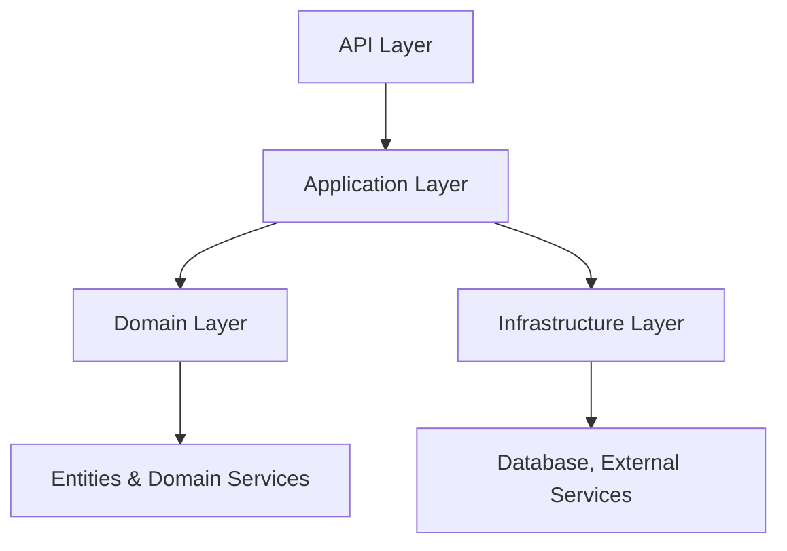

# 🏗️ Clean Architecture Demo

This project demonstrates a modern, scalable, and maintainable software development architecture by implementing **Clean Architecture**, **CQRS**, **MediatR**, and **AutoMapper** patterns.

---

## 📂 Layered Architecture Structure

### 1. Domain Layer
- Contains core business logic and domain models.  
- Defines entities, value objects, and domain services.

### 2. Application Layer
- Implements **CQRS (Command-Query Responsibility Segregation)**.  
- Separates command and query operations for flexibility and readability.  
- Uses **MediatR** for loosely coupled handlers.  
- Contains DTOs, validators, and AutoMapper profiles.

### 3. Infrastructure Layer
- Includes database connections, external service integrations, email services, etc.  
- Utilizes **Entity Framework Core** and/or **Dapper**.

### 4. API Layer
- Presentation layer defining RESTful endpoints.  
- The only layer exposed to external users.

---

## 🚀 Features

- ✅ Layered architecture with clear separation of concerns  
- ✅ Modern design with CQRS and MediatR  
- ✅ Fast data mapping using AutoMapper  
- ✅ Data validation with FluentValidation  
- ✅ Simple, modular, and unit-test friendly structure  
- ✅ Code following SOLID principles  

---

## 🧪 Technologies Used

| Area              | Technology/Tool           |
|-------------------|--------------------------|
| Backend Framework  | ASP.NET Core             |
| ORM               | Entity Framework Core, Dapper |
| Patterns          | CQRS, MediatR, AutoMapper |
| Validation        | FluentValidation         |
| Database          | SQL Server / PostgreSQL  |
| Messaging (Optional) | RabbitMQ                |

---

## 🛠️ Setup

```bash
# 1. Clone the repository
git clone https://github.com/Yusuftmle/CleanArchitectureDemo.git

# 2. Restore necessary NuGet packages
dotnet restore

# 3. Update database settings (appsettings.json)

# 4. Apply database migrations (example)
dotnet ef database update

# 5. Run the application
dotnet run
```


